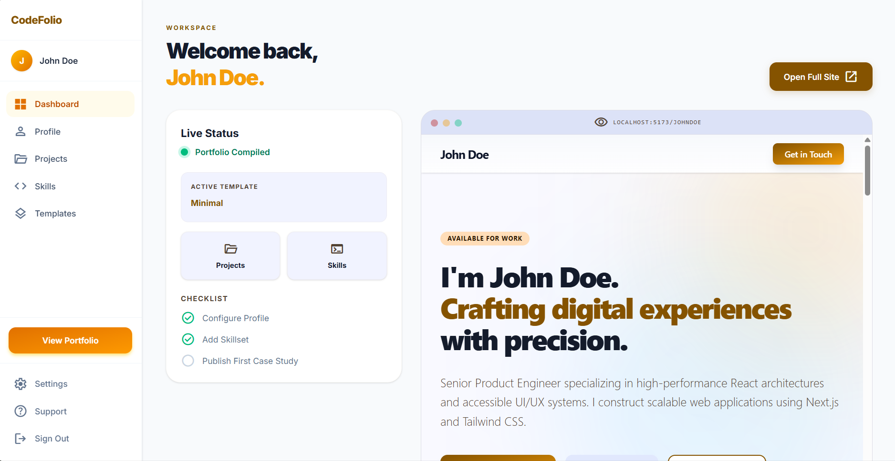
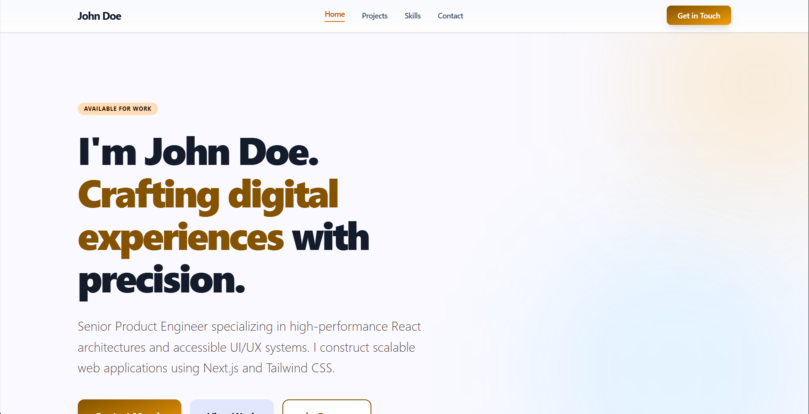
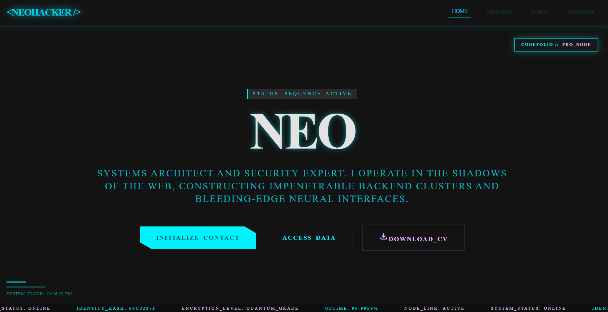

# 🚀 CodeFolio

A modern developer portfolio generator that allows engineers to create and deploy professional portfolios instantly using structured data and pre-built templates.

---

## 📌 Overview

CodeFolio is a full-stack application that converts developer data (projects, skills, profile) into a live portfolio website.
It eliminates the need to build portfolios from scratch and focuses on speed, simplicity, and performance.

---

## ❗ Problem Statement

Developers often spend too much time building personal portfolio websites instead of focusing on actual work.
CodeFolio solves this by providing a no-code/low-code system to generate portfolios instantly with minimal effort.

---

## ✨ Features

* Dashboard-based portfolio builder (CMS)
* Dynamic project & skill management
* Multiple portfolio templates
* Real-time preview (dashboard)
* Public portfolio via `/username`
* SEO optimization (dynamic meta tags)
* Contact form with email integration

---

## 🛠 Tech Stack

**Frontend**

* React (Vite)
* Tailwind CSS
* React Router
* React Helmet

**Backend**

* Node.js
* Express.js

**Database**

* MongoDB (Mongoose)

**Other Tools**

* JWT Authentication
* Bcrypt
* Nodemailer

---


## 📁 Project Structure

```text
CodeFolio/
├── client/                # React Frontend
│   ├── src/
│   │   ├── components/    # Reusable UI components (Sidebar, TopNav, etc.)
│   │   ├── pages/         # Page-level components (Dashboard, Profile, etc.)
│   │   ├── templates/     # Dynamic portfolio templates & Layouts
│   │   ├── App.jsx        # Root routing and providers
│   │   └── main.jsx       # Mount point
├── server/                # Express Backend
│   ├── controllers/       # Request handlers (logic)
│   ├── models/            # Mongoose schemas (data)
│   ├── routes/            # API endpoints
│   ├── middleware/        # Auth guards (JWT)
│   └── index.js           # Server entry point
└── README.md              # Project documentation
```

---

## ⚙️ Setup

```bash
# Clone repo
git clone https://github.com/kiruop/CodeFolio.git
cd CodeFolio

# Install dependencies
cd client && npm install
cd ../server && npm install

# Create .env file using .env.example (ensure MongoDB Atlas is configured):

PORT=5000
MONGO_URI=your_mongodb_connection
EMAIL_USER=your_email
EMAIL_PASS=your_password
JWT_SECRET=your_jwt_secret

# Run backend
cd server
npm run dev

# Run frontend
cd client
npm run dev
```

---

## 🔑 Demo Credentials


- **Minimal Template Persona:**
  - Login: 
    - Username: `johndoe` 
    - Email: `john@example.com`
    - Password: `password123`

- **Cyberpunk PRO Persona:**
  - Login: 
    - Username: `neohacker` 
    - Email: `neo@matrix.io`
    - Password: `password123`

---

## 📸 Screenshots






---

## 🧠 System Design Note

The routing for dynamic portfolio URLs (`/:username`) is handled using a **backend-driven approach**.

* A generic route is defined in the backend:

  ```
  GET /:username
  ```

* When a request is made, the server:

  1. Extracts the `username` from the URL
  2. Queries the database to find the corresponding user
  3. Returns the user’s portfolio data

* On the frontend, React uses this data to dynamically render the portfolio using the selected template.

### Why Backend Routing?

* Ensures data is fetched securely before rendering
* Improves SEO by serving correct metadata
* Allows direct access to portfolio URLs without relying solely on client-side routing

### Alternative Consideration

React Router parameters (`useParams`) could be used for client-side routing, but backend routing was preferred to ensure:

* Better SEO handling
* Reliable data fetching
* Direct URL access without dependency on frontend state

---


---

## 🤝 Contribution Guide

1. Fork the repository
2. Create a feature branch
3. Commit changes
4. Push and open a Pull Request

---

## 🚧 Future Todos

* More portfolio templates
* Custom domain support
* Drag-and-drop builder
* Analytics dashboard

---

## 📜 License

MIT License

---

## 👨‍💻 Developer

**Name:** Kiran Biradar

**GitHub:** https://github.com/kiruop

**Linkedin:** https://www.linkedin.com/in/kiranbiradar/
   
---
